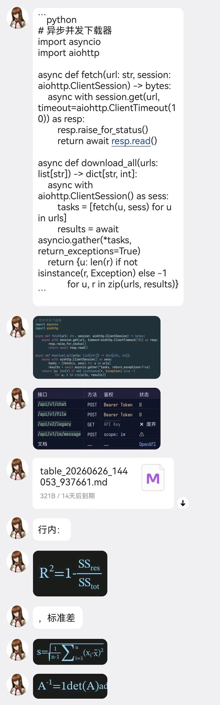

# Markdown 渲染插件

把 QQ 消息中的 Markdown **代码块**、**表格**、**数学表达式**渲染为图片，让机器人回复不再满屏源码。表格支持格内 **加粗**、*斜体*、~~删除线~~、`代码`、[链接](url) 等行内格式。

## 效果展示



| 代码块 | 表格（格内格式） |
|--------|------------------|
|  |  |

| 行内表达式 | 块级表达式 |
|-----------|-----------|
|  |  |

## 配置项

| 配置项 | 可选值 | 默认 | 说明 |
|--------|--------|------|------|
| 代码块 | 不处理 / 渲染图像 / 渲染且保留原文 / 渲染且md文件 / 仅md文件 | 渲染且md文件 | `仅md文件` 只发 .md 不渲染 |
| 表格 | 不处理 / 渲染图像 / 渲染且保留原文 / 渲染且md文件 / 仅md文件 | 渲染图像 | `仅md文件` 只发 .md 不渲染 |
| 表达式 | 不处理 / 渲染图像 / 渲染且保留原文 | 渲染图像 | 支持 $...$ 行内和 $$...$$ 块级 |
| 分隔线 | 不处理 / 切分 | 不处理 | `切分` 用于给分片插件提供断点 |
| 字体颜色 | 多种预设 | `#9CDCFE` (浅蓝) | — |
| 背景颜色 | 多种预设 | `#1E1E1E` (VS Code 深色) | — |
| 临时文件存活 | 整数（分钟） | 0 | 0=即时删除（默认），-1=永久保留 |

## 特殊说明

### 字体自动下载

插件首次启动会自动下载 [更纱等宽黑体](https://github.com/be5invis/Sarasa-Gothic)（Sarasa Mono SC），中英文 2:1 严格等宽，约 8 MB。下载不阻塞启动，期间代码块可能无中文字体。

### Markdown 格式清洗

插件会在渲染代码块/表格/表达式后，对剩余文本中的 Markdown 格式标记进行清洗。每种格式可独立开关，默认全部开启。

| 格式 | 语法 | 清洗后 |
|------|------|--------|
| 加粗 | `**text**` | `text` |
| 斜体 | `*text*` | `text` |
| 删除线 | `~~text~~` | `text` |
| 行内代码 | `` `text` `` | `text` |
| 链接 | `[text](url)` | `text (url)` |
| 标题 | `# text` | `text` |
| 无序列表 | `- item` | `item` |
| 有序列表 | `1. item` | `item` |
| 引用 | `> text` | `text` |
| 图片 | `` | `alt (url)` |

清洗基于 markdown-it-py 的 CommonMark 语法解析，颜表情如 `(￣▽￣*)` 中的 `*` 不会被误判为斜体。

### 已渲染元素清洗

以下选项控制代码块、表格、表达式在**以文本形式保留**时（即渲染模式设为"不处理"或"渲染且保留原文"）是否去除其 markdown 标记。不影响渲染生成的图片/文件。

| 格式 | 语法 | 清洗后 |
|------|------|--------|
| 代码块 | `` ```py\ncode\n``` `` | `code` |
| 表格 | `\| A \| B \|` + 分隔行 | `A \| B` |
| 表达式 | `$E=mc^2$` / `$$...$$` | `E=mc^2` |

默认全部 **关闭**，与格式标记清洗（默认开启）区分。

