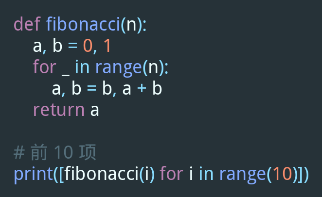
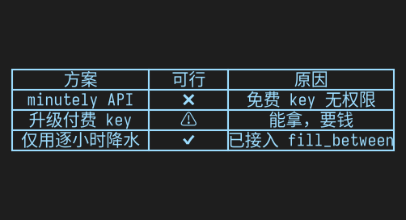
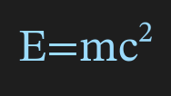
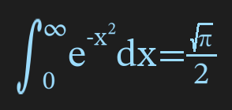

# Markdown 渲染插件

把 QQ 消息中的 Markdown **代码块**、**表格**、**数学表达式**渲染为图片，让机器人回复不再满屏源码。表格支持格内 **加粗**、*斜体*、~~删除线~~、`代码`、[链接](url) 等行内格式。

## 效果展示

| 代码块 | 表格（格内格式） |
|--------|------------------|
|  |  |

| 行内表达式 | 块级表达式 |
|-----------|-----------|
|  |  |

## 配置项

| 配置项 | 可选值 | 默认 | 说明 |
|--------|--------|------|------|
| 代码块 | 不处理 / 渲染图像 / 渲染且保留原文 / 渲染且md文件 / 仅md文件 | 渲染且md文件 | `仅md文件` 只发 .md 不渲染 |
| 表格 | 不处理 / 渲染图像 / 渲染且保留原文 / 渲染且md文件 / 仅md文件 | 渲染图像 | `仅md文件` 只发 .md 不渲染 |
| 表达式 | 不处理 / 渲染图像 / 渲染且保留原文 | 渲染图像 | 支持 $...$ 行内和 $$...$$ 块级 |
| 分隔线 | 不处理 / 切分 | 不处理 | `切分` 用于给分片插件提供断点 |
| 字体颜色 | 多种预设 | `#9CDCFE` (浅蓝) | — |
| 背景颜色 | 多种预设 | `#1E1E1E` (VS Code 深色) | — |
| 字形映射 | JSON | 见默认值 | 缺字时替换为相似字符，防豆腐块 |
| 临时文件存活 | 整数（分钟） | 5 | 0=即时删除，-1=永久保留 |

## 特殊说明

### 字体自动下载

插件首次启动会自动下载 [更纱等宽黑体](https://github.com/be5invis/Sarasa-Gothic)（Sarasa Mono SC），中英文 2:1 严格等宽，约 8 MB。下载不阻塞启动，期间代码块可能无中文字体。

### 字形映射

部分特殊符号（如 `✅`、`✗`）在某些字体中缺字形。插件会按配置的映射表自动替换为相似字符（如 `✅`→`✔`），避免显示豆腐块。可在配置面板修改映射 JSON。

### 分隔线切分

`分隔线: 切分` 会将 `---` 作为消息断点插入 chain，配合 [astrbot_plugin_splitter](https://github.com/AstrBotDevs/astrbot_plugin_splitter) 可实现智能分段。需同时安装该插件。
